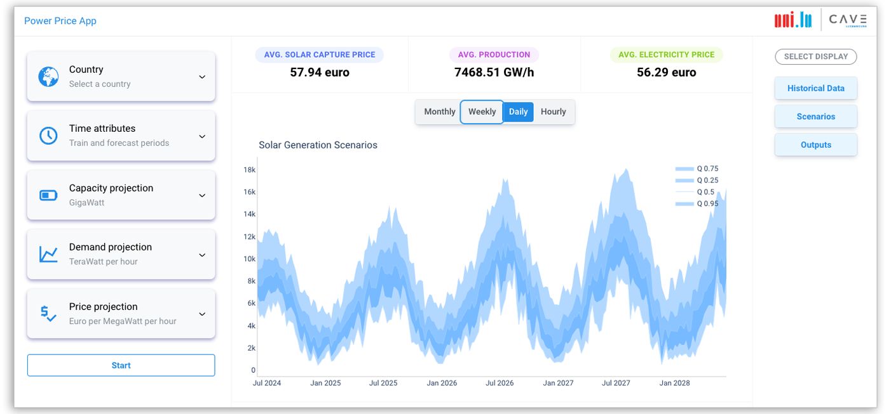

# Power Price Forecasting (PPF) app

## About the app

- This is an nalytics web app to forecast future electricity prices based on market fundamentals using a combination of fundamental market modeling, inverse optimization techniques, and machine learning.
- The mission is to compute contract prices (capture price) as a KPI for Power Purchase Agreements (PPAs) to assist large industrial consumers in meeting their sustainability targets.

## Packages and Frameworks
* [Dash](https://dash.plot.ly/) - Main server and interactive components
* [Plotly Python](https://plot.ly/python/) - Used to create the interactive plots

## Screenshot

